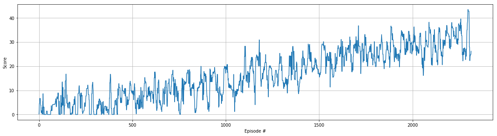

# Learning Algorithm

The learning algorithm I used for this project is a **Deep Deterministic Policy Gradient**, whose full description can be found in [the original paper](https://arxiv.org/pdf/1509.02971.pdf).

DDPG is an actor-critic algorithm, and its basically an extension of DQN to continuous actions spaces.

The actor is used to approximate the optimal policy deterministically, differently from other actor-critic algorithms that learn stochastic policies (i.e. a probability distribution over the actions).

The critic learns to evaluate the optimal action-value functions by using the actor estimated best actions.

## Hyperparameters and model architecture

The environment has been solved the following hyperparameters:

```
BUFFER_SIZE = int(1e6)  # replay buffer size
BATCH_SIZE = 256        # minibatch size
GAMMA = 0.99            # discount factor
TAU = 1e-3              # for soft update of target parameters
LR_ACTOR = 1e-5         # learning rate of the actor 
LR_CRITIC = 3e-5        # learning rate of the critic
WEIGHT_DECAY = 0.0001   # L2 weight decay
mu=0.0, theta=0.15, sigma=0.2  # parameters for the Ornstein-Uhlenbeck noise
```

The model architecture is the following:

* Actor: 1 hidden layer for the actor, with 256 units
* Critic: 3 hidden layers, with [256, 256, 128] units respectively

## Plot of Rewards

Environment was solved in 2467 episodes, with a quite stable learning trajectory.



```
Episode 100	Average Score: 1.45
Episode 200	Average Score: 3.08
Episode 300	Average Score: 4.29
Episode 400	Average Score: 6.47
Episode 500	Average Score: 7.80
Episode 600	Average Score: 9.03
Episode 700	Average Score: 9.94
Episode 800	Average Score: 10.80
Episode 900	Average Score: 12.86
Episode 1000	Average Score: 14.84
Episode 1100	Average Score: 17.12
Episode 1200	Average Score: 16.97
Episode 1300	Average Score: 19.80
Episode 1400	Average Score: 19.34
Episode 1500	Average Score: 19.99
Episode 1600	Average Score: 20.87
Episode 1700	Average Score: 22.02
Episode 1800	Average Score: 21.22
Episode 1900	Average Score: 23.03
Episode 2000	Average Score: 24.37
Episode 2100	Average Score: 24.13
Episode 2200	Average Score: 26.33
Episode 2300	Average Score: 25.24
Episode 2400	Average Score: 27.95
Episode 2467	Average Score: 30.07
Environment solved in 2467 episodes!	Average Score: 30.07
```


## Ideas for Future Work

- Study the impact of Hyperparameters
- Trying other algorithms like PPO, A3C or D4PG
- Implement an evolutionary strategies and compare it with Actor-Critic gradient-based approaches